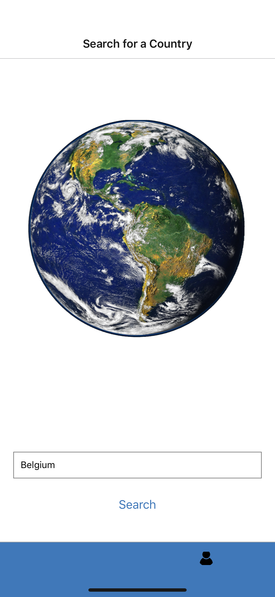
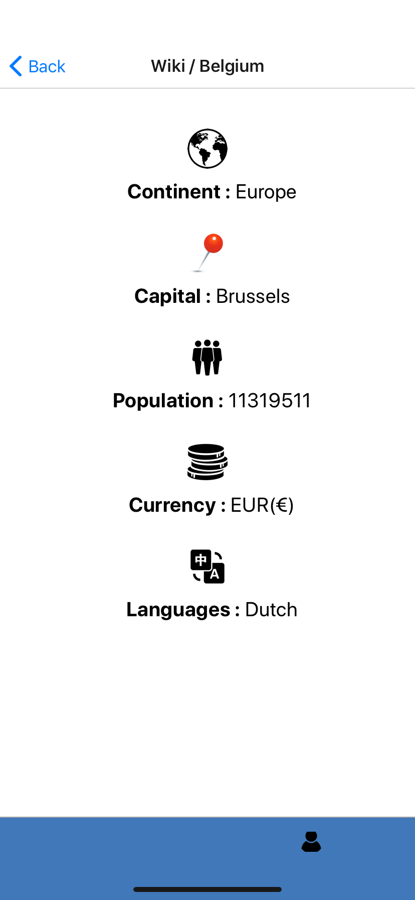

# Application WikiCountry

## Project realised by 

- Paul Leroy 4A
- Alexandre Haye 4A
- Paul-Alexis Mandengué 4A

## Presentation

Simple mobile project in React native.
This application show a description of the country. It use the API of https://restcountries.eu/rest/v2/

````
https://github.com/LePaulLeroy/projet4a/
````

## Fonctionnalities: 

### First screen 

- Home menu of the application



### Description screen  

- Show the descritpion of the country with : Continent, Capital, Population, Currencies, Languages

   

### About Us screen 

- Show the informations of the app

 

